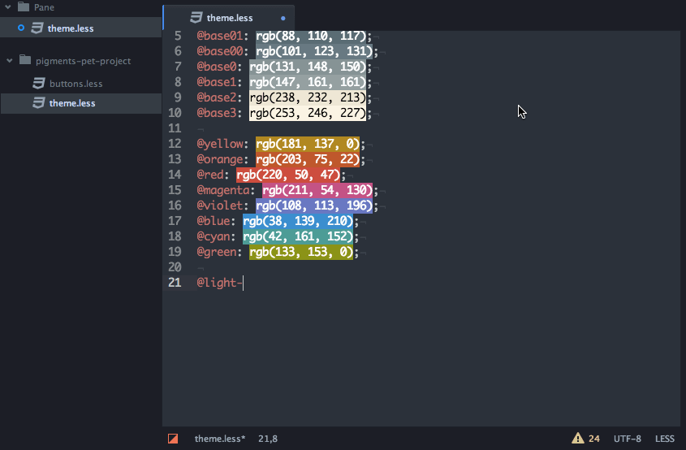

# Awesome Atom 

A curated list of delightful Atom packages and resources. For more awesomeness, check out [awesome](https://github.com/sindresorhus/awesome).

## Table of Contents

<!-- TOC depthFrom:2 depthTo:6 withLinks:1 updateOnSave:1 orderedList:0 -->

- [Table of Contents](#table-of-contents)
- [Atom Customisation](#atom-customisation)
	- [[Editor Config](https://atom.io/packages/editorconfig)](#editor-confighttpsatomiopackageseditorconfig)
	- [[File Icons](https://atom.io/packages/file-icons)](#file-iconshttpsatomiopackagesfile-icons)
	- [[Fonts](https://atom.io/packages/fonts)](#fontshttpsatomiopackagesfonts)
	- [[Jumpy](https://atom.io/packages/jumpy)](#jumpyhttpsatomiopackagesjumpy)
	- [[Minimap](https://atom.io/packages/minimap)](#minimaphttpsatomiopackagesminimap)
	- [[Pigments](https://atom.io/packages/pigments)](#pigmentshttpsatomiopackagespigments)
	- [[Project Plus](https://atom.io/packages/project-plus)](#project-plushttpsatomiopackagesproject-plus)
	- [[Sync Settings](https://atom.io/packages/sync-settings)](#sync-settingshttpsatomiopackagessync-settings)
- [Editing](#editing)
	- [[Advanced Open File](https://atom.io/packages/advanced-open-file)](#advanced-open-filehttpsatomiopackagesadvanced-open-file)
	- [[Atom Reverser](https://atom.io/packages/atom-reverser)](#atom-reverserhttpsatomiopackagesatom-reverser)
	- [[Beautify](https://atom.io/packages/atom-beautify)](#beautifyhttpsatomiopackagesatom-beautify)
	- [[Color Picker](https://atom.io/packages/color-picker)](#color-pickerhttpsatomiopackagescolor-picker)
	- [[Copy Paste](https://atom.io/packages/copy-paste)](#copy-pastehttpsatomiopackagescopy-paste)
	- [[Duplicate Selection](https://atom.io/packages/duplicate-line-or-selection)](#duplicate-selectionhttpsatomiopackagesduplicate-line-or-selection)
	- [[Sort Lines](https://atom.io/packages/sort-lines)](#sort-lineshttpsatomiopackagessort-lines)
	- [[Toggle Quotes](https://atom.io/packages/toggle-quotes)](#toggle-quoteshttpsatomiopackagestoggle-quotes)
- [Languages](#languages)
	- [Syntax](#syntax)
	- [Linting](#linting)
	- [Building](#building)
	- [Generic](#generic)
		- [[Code Peek](https://atom.io/packages/code-peek)](#code-peekhttpsatomiopackagescode-peek)
	- [WebDev (HTML/CSS)](#webdev-htmlcss)
		- [[Emmet](https://atom.io/packages/emmet)](#emmethttpsatomiopackagesemmet)
	- [Markdown](#markdown)
		- [[Markdown TOC](https://atom.io/packages/markdown-toc)](#markdown-tochttpsatomiopackagesmarkdown-toc)
		- [[Markdown Writer](https://atom.io/packages/markdown-writer)](#markdown-writerhttpsatomiopackagesmarkdown-writer)
	- [Javascript](#javascript)
		- [[TernJS](https://atom.io/packages/atom-ternjs)](#ternjshttpsatomiopackagesatom-ternjs)
	- [Ruby/Rails](#rubyrails)
		- [[Rails Open Rspec](https://atom.io/packages/rails-open-rspec)](#rails-open-rspechttpsatomiopackagesrails-open-rspec)
- [Version Control](#version-control)
	- [[Merge Conflicts](https://atom.io/packages/merge-conflicts)](#merge-conflictshttpsatomiopackagesmerge-conflicts)
- [Terminal / OS Integration](#terminal-os-integration)
	- [[Atom Terminal](https://atom.io/packages/atom-terminal)](#atom-terminalhttpsatomiopackagesatom-terminal)
	- [[Terminal-Plus](https://atom.io/packages/terminal-plus)](#terminal-plushttpsatomiopackagesterminal-plus)
- [Productivity](#productivity)
	- [[iMDone](https://atom.io/packages/imdone-atom)](#imdonehttpsatomiopackagesimdone-atom)
- [Extensions](#extensions)
	- [[Nuclide](https://nuclide.io/)](#nuclidehttpsnuclideio)

<!-- /TOC -->

## Atom Customisation

### [Editor Config](https://atom.io/packages/editorconfig)
> [EditorConfig](http://editorconfig.org) helps developers maintain consistent coding styles between different editors

### [File Icons](https://atom.io/packages/file-icons)
> Adds file specific icons to atom for improved visual grepping. Works with Tree View and Fuzzy Finder and Tabs.

### [Fonts](https://atom.io/packages/fonts)
> Lots of monospace fonts.

### [Jumpy](https://atom.io/packages/jumpy)
> An Atom package that creates dynamic hotkeys to jump around files across visible panes.

### [Minimap](https://atom.io/packages/minimap)
> A preview of the full source code.

### [Pigments](https://atom.io/packages/pigments)
> A package to display colors in project and files.

  

### [Project Plus](https://atom.io/packages/project-plus)
> Simply awesome project management in Atom.

### [Sync Settings](https://atom.io/packages/sync-settings)
> Synchronize package settings, keymap and installed packages across Atom instances.

## Editing

### [Advanced Open File](https://atom.io/packages/advanced-open-file)
> Helps Atom users to open files and folders easily. It can also creates new files and folders if they don't currently exist.

### [Atom Reverser](https://atom.io/packages/atom-reverser)
> Reverses your current selections; e.g. `false` to `true`

### [Beautify](https://atom.io/packages/atom-beautify)
> [Beautify](https://github.com/beautify-web/js-beautify)
HTML (including [Handlebars](http://handlebarsjs.com/)),
CSS (including [Sass](http://sass-lang.com/) and [LESS](http://lesscss.org/)),
JavaScript, and much more in Atom.

### [Color Picker](https://atom.io/packages/color-picker)
> Color picker that supports HEX, HEXa, RGB, RGBa, HSL, HSLa, HSV, HSVa, VEC3, VEC4 – and is able to convert between the formats. It also inspects Sass and LESS color variables.

### [Copy Paste](https://atom.io/packages/copy-paste)
> Types in your code for your from the clipboard/buffer. Simply copy the code and hit the shortcut to watch your code being typed. Copy paste is ideal for screencasts and online courses.

### [Duplicate Selection](https://atom.io/packages/duplicate-line-or-selection)
> Duplicates the selection if there is one, otherwise, duplicates the line.

### [Sort Lines](https://atom.io/packages/sort-lines)
> Sorts your lines. Never gets tired.

### [Toggle Quotes](https://atom.io/packages/toggle-quotes)
> Quickly toggle between single and double quotes.

## Languages

### Syntax

Language packages extend the editor with syntax highlighting and/or
snippets for a specific language or file format.

 - [Angular](https://atom.io/packages/angularjs)
 - [Dockerfile](https://atom.io/packages/language-docker)
 - [React](https://atom.io/packages/react)
 - [Stylus](https://atom.io/packages/stylus)
 - [TypeScript](https://atom.io/packages/atom-typescript)

### Linting

In case the awesome nirvana that is linting has not yet been unleashed upon you:
> lint was the name originally given to a particular program that flagged some suspicious and non-portable constructs (likely to be bugs) in C language source code. The term is now applied generically to tools that flag suspicious usage in software written in any computer language.

To enable linting, you'll need the general [linter](https://atom.io/packages/linter) which provides the interface for the provider plugins for specific languages. The full list of current plugins can be found at [atomlinter.github.io](http://atomlinter.github.io/), a few examples being:

 - [C++](https://atom.io/packages/linter-clang) — clang
 - [CSS](https://atom.io/packages/linter-stylelint) — stylelint
 - [JavaScript](https://atom.io/packages/linter-eslint) — eslint
 - [Python](https://atom.io/packages/linter-pylama) — pylama
 - [SASS](https://atom.io/packages/linter-sass-lint) — sass-lint
 - [Stylus](https://atom.io/packages/linter-stylint) — stylint
 - [TypeScript](https://atom.io/packages/linter-tslint) - tslint

 

### Building

To enable building, you'll need the general [build](https://atom.io/packages/build) which provides the interface for the provider plugins for specific languages and adds integrates with [lint](#lint). The full list of current plugins can be found at [atombuild.github.io](http://atombuild.github.io/), a few examples being:

 - [AppleScript](https://atom.io/packages/build-applescript) — oscompile
 - [C/C++/Objective C](https://atom.io/packages/build-xcodebuild) — xcodebuild
 - [CoffeeScript](https://atom.io/packages/build-coffee) - coffee
 - [GNU Make](https://github.com/AtomBuild/atom-build-make) - make
 - [Sass](https://atom.io/packages/build-sass) — sass
 - [TypeScript](https://atom.io/packages/build-tsc) - tsc

 

### Generic

#### [Code Peek](https://atom.io/packages/code-peek)
> Quickly peek and edit functions in separate files from the context of your current editor.

### WebDev (HTML/CSS)

#### [Emmet](https://atom.io/packages/emmet)
> Plugin which greatly improves HTML and CSS writing. Shortcuts can expand to complete set of HTML or CSS selectors.

### Markdown

#### [Markdown TOC](https://atom.io/packages/markdown-toc)
> Generate TOC (table of contents) of headlines from parsed markdown file.

#### [Markdown Writer](https://atom.io/packages/markdown-writer)
> Adds tons of features to make Atom an even better Markdown/AsciiDoc editor! Works great with static blogging as well.

### Javascript

#### [TernJS](https://atom.io/packages/atom-ternjs)
> Javascript code intelligence for atom with tern.js and autocomplete-plus.

### Ruby/Rails

#### [Rails Open Rspec](https://atom.io/packages/rails-open-rspec)
> Open rspec file by current file in rails project.

## Version Control

### [Merge Conflicts](https://atom.io/packages/merge-conflicts)
> Resolve your git merge conflicts in Atom.

## Terminal / OS Integration

### [Atom Terminal](https://atom.io/packages/atom-terminal)
> Launch terminal app on current file's directory with "Ctrl-Shift-T" in Atom.

### [Terminal-Plus](https://atom.io/packages/terminal-plus)
> The terminal inside the editor complete with themes and more.

## Productivity

### [iMDone](https://atom.io/packages/imdone-atom)
> A task-board for TODOs, FIXMEs, HACKs, etc in your code.

## Extensions

###[Nuclide](https://nuclide.io/)
An open IDE for web and native mobile development, built on top of Atom maintained by [Facebook](https://github.com/facebook/nuclide).

